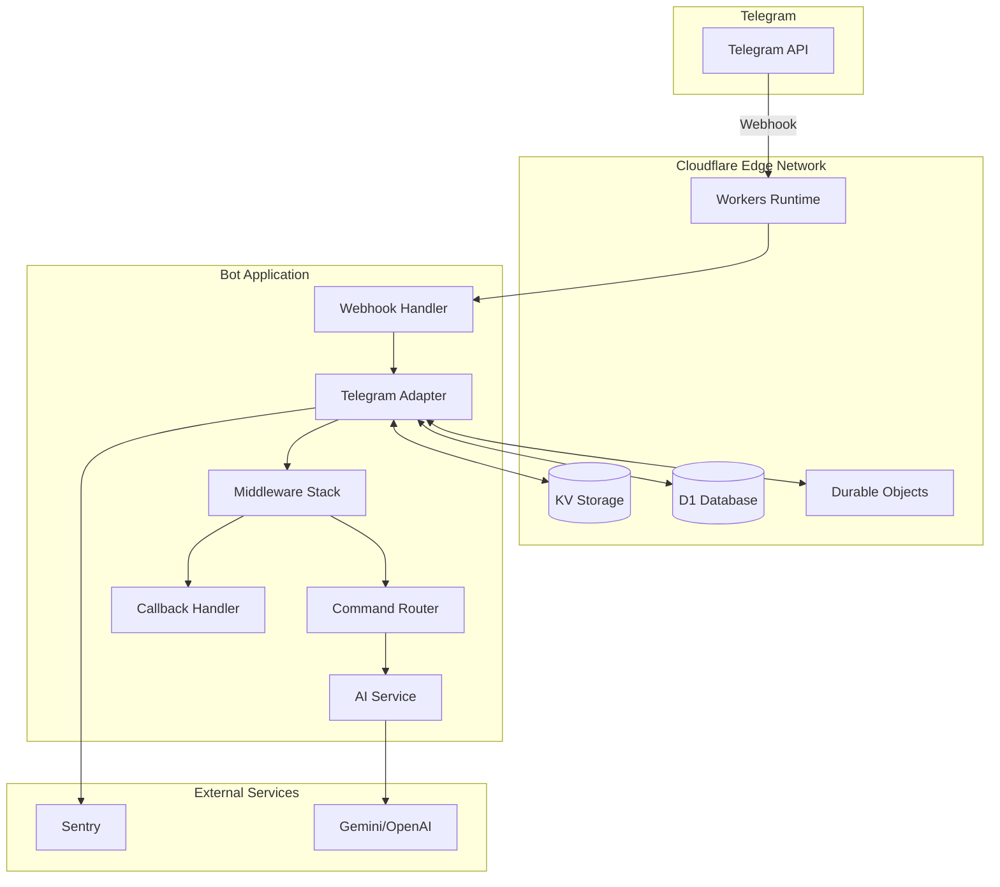

# 🏗️ Project Overview

## Architecture Diagram



## 🛠️ Technology Stack

### Core Runtime

- **Cloudflare Workers** - V8 isolates for edge computing
- **TypeScript 5.x** - Type-safe development with strict mode
- **Hono 4.x** - Ultra-fast web framework optimized for edge

### Bot Framework

- **grammY 1.x** - Modern Telegram Bot API framework
- **grammY Plugins** - Conversations, menus, and more

### Storage Solutions

- **KV Namespace** - Key-value storage for sessions and caching
- **D1 Database** - SQLite at the edge for structured data
- **Durable Objects** - Stateful coordination (optional)

### Development Tools

- **Wrangler 3.x** - Cloudflare Workers CLI
- **Vitest** - Fast unit testing framework
- **ESLint 9** - Modern linting with flat config
- **Prettier** - Code formatting

### Monitoring & AI

- **Sentry** - Error tracking and performance monitoring
- **Multi-Provider AI** - Gemini, OpenAI, xAI, DeepSeek, Cloudflare AI

## ⚡ Quick Start (3 Minutes)

### 1. Clone and Install (30 seconds)

```bash
git clone https://github.com/talkstream/typescript-wireframe-platform.git my-bot
cd my-bot
npm install
```

### 2. Configure Environment (1 minute)

```bash
# Copy example configuration
cp .env.example .dev.vars

# Edit .dev.vars with your bot token
TELEGRAM_BOT_TOKEN=your_bot_token_here
```

### 3. Run Locally (30 seconds)

```bash
npm run dev
```

### 4. Set Webhook (1 minute)

```bash
# After getting your worker URL from wrangler
curl "https://api.telegram.org/bot<YOUR_TOKEN>/setWebhook?url=https://<YOUR_WORKER>.workers.dev/webhook"
```

That's it! Your bot is running locally. 🎉

## 🏛️ Project Structure

```
├── src/
│   ├── index.ts                 # Entry point
│   ├── config/                  # Configuration and environment
│   ├── core/                    # Core bot logic
│   │   ├── bot.ts              # Bot initialization
│   │   └── telegram-adapter.ts  # Main adapter (full features)
│   ├── adapters/telegram/       # Telegram-specific implementations
│   │   ├── commands/           # Command handlers
│   │   ├── callbacks/          # Callback query handlers
│   │   ├── handlers/           # Other handlers (payments, etc.)
│   │   └── cloudflare-workers/ # Cloudflare Workers optimizations
│   │       └── free-tier-adapter.ts # Optimized for 10ms CPU limit
│   ├── middleware/             # Middleware stack
│   ├── services/               # Business logic
│   └── lib/                    # Shared utilities
├── migrations/                 # Database migrations
├── docs/                       # This documentation
└── tests/                      # Test suites
```

## 🎯 Key Concepts

### 1. Edge-First Architecture

The bot runs on Cloudflare's global edge network, providing:

- Low latency responses worldwide
- Automatic scaling
- Built-in DDoS protection
- Zero cold starts in most regions

### 2. Webhook-Based Processing

Unlike polling bots, this wireframe uses webhooks for:

- Real-time message processing
- Efficient resource usage
- No wasted API calls
- Immediate response to users

### 3. Tier-Aware Optimization

The wireframe automatically adapts to your Cloudflare plan:

- **Free Tier**: Lightweight adapter, essential features (10ms CPU)
- **Paid Tier**: Full features, AI integration, advanced caching (30s CPU)

### 4. Type Safety Throughout

Every component is fully typed:

- Telegram API types
- Environment variables
- Database schemas
- Command arguments

## 🔥 Performance Characteristics

### Response Times

- **P50**: < 50ms globally
- **P95**: < 150ms globally
- **P99**: < 300ms globally

### Resource Usage

- **Memory**: < 128MB per request
- **CPU Time**: < 10ms (free) / < 30s (paid)
- **Startup Time**: < 5ms (no cold starts)

### Scalability

- **Requests**: Unlimited concurrent
- **Geographic**: 200+ locations
- **Rate Limits**: Respects Telegram limits automatically

## 🛡️ Security Features

- **Webhook Validation**: Cryptographic verification
- **Input Sanitization**: Zod schema validation
- **Rate Limiting**: Per-user and global limits
- **Error Isolation**: Sentry integration
- **Secrets Management**: Environment variables

## 🚀 Next Steps

1. Read the [Architecture Decisions](./ARCHITECTURE_DECISIONS.md) to understand design choices
2. Follow the [Development Guide](./DEVELOPMENT_GUIDE.md) for detailed setup
3. Check [API Reference](./API_REFERENCE.md) for implementation details
4. Deploy using the [Deployment Guide](./DEPLOYMENT.md)

---

_Built with passion and care for the developer community._
